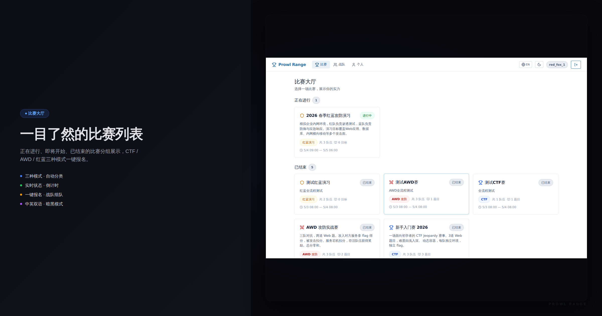
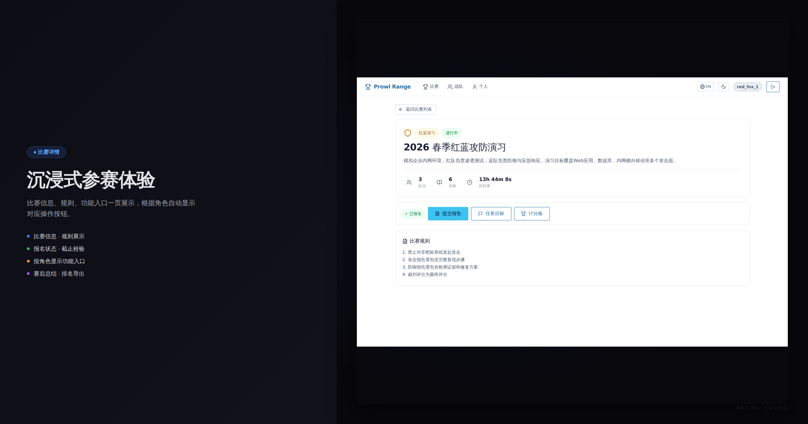
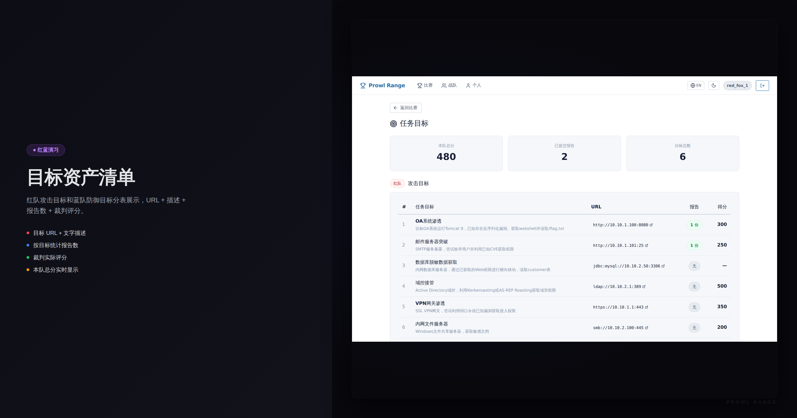
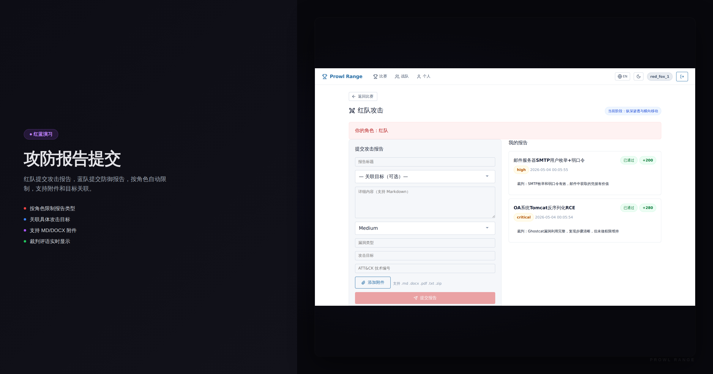
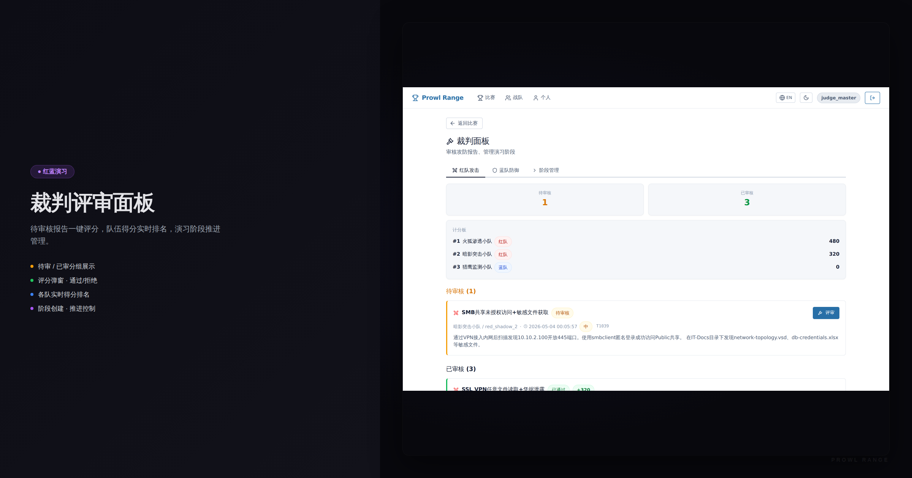
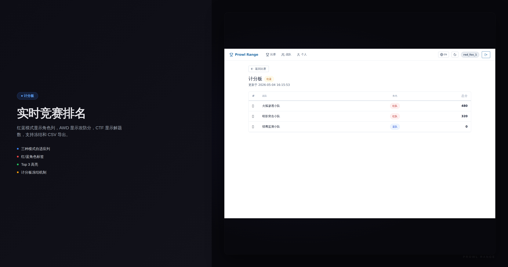
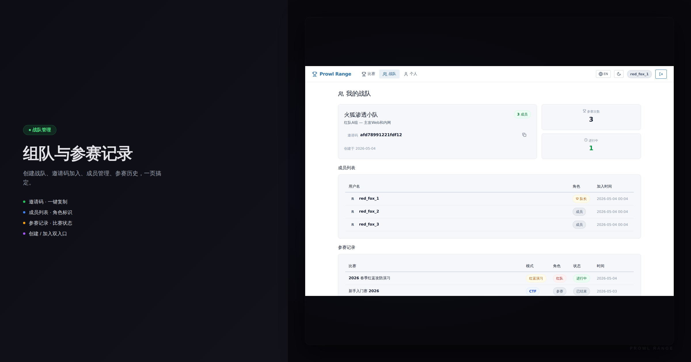
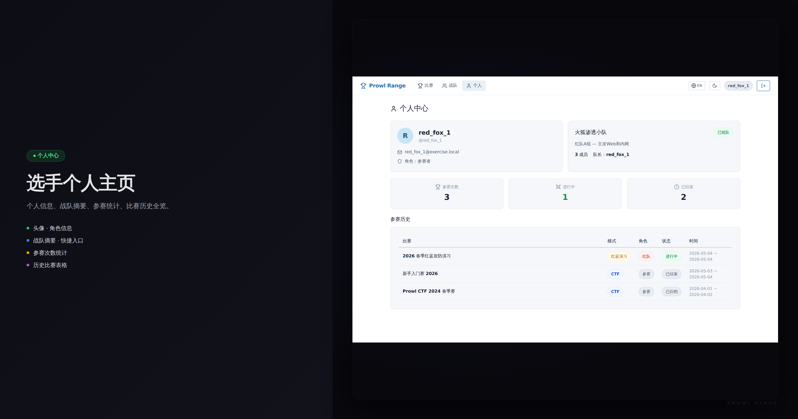
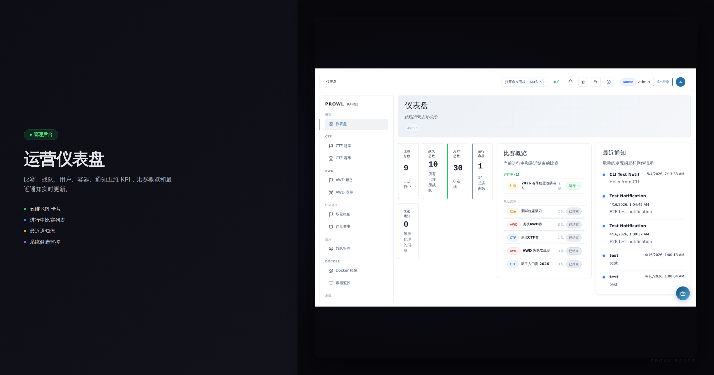

# Prowl Range

一个专门用于应付领导让你举办 CTF、AWD、红蓝对抗的项目。

三种模式开箱即用，从出题到比赛到评分到导出排名，一条龙搞定。

## 快速搭建

```bash
git clone https://github.com/ZacharyZcR/Prowl.git
cd Prowl
cp .env.example .env
# 改一下 JWT_SECRET
docker compose up -d --build
```

跑起来之后：

| 服务 | 地址 | 说明 |
|---|---|---|
| 管理后台 | http://localhost:3080 | admin / admin123 |
| 参赛端 | http://localhost:3000 | 选手自助注册 |
| API | http://localhost:38080 | 后端接口 |

## 产品展示

### 参赛端

















### 管理后台



## 支持的比赛模式

**CTF Jeopardy** — 经典解题赛，支持动态容器、指数衰减计分、First Blood、Hint 解锁

**AWD 攻防** — 每队独立容器环境，自动轮次检测，零和计分，Flag 注入与窃取，付费重启

**红蓝演习** — 目标派发（URL + 描述），红队提交攻击报告，蓝队提交防御报告，裁判面板评分，ATT&CK 技术映射，阶段推进，演习总结

## 技术栈

| 层 | 技术 |
|---|---|
| 后端 | Go, Gin, Ent ORM, PostgreSQL, Redis |
| 管理前端 | React, TypeScript, Vite |
| 参赛前端 | React, TypeScript, Vite |
| CLI | Go, Cobra |
| 设计系统 | @yza/ui + @yza/tokens |
| 容器 | Docker Compose |

## CLI

```bash
cd cli && go build -o prowl ./cmd/prowl/
./prowl health
./prowl login
./prowl competition list
./prowl challenge list
./prowl awd deploy 1
./prowl redblue attack-reports 1
./prowl scenario batch-objectives 1 objectives.json
```

30+ 命令覆盖全部业务 API。`prowl --help` 看完整列表。

## 项目结构

```
Prowl/
├── backend/          Go 后端
├── frontend/         管理后台前端
├── portal/           参赛端前端
├── cli/              CLI 工具
├── design-system/    组件库 + Design Tokens
├── docker/           开发环境 Compose
├── docker-compose.yml  一键部署
└── .env.example      环境变量模板
```

## 推荐

如果你是大学生或者 CTF 爱好者，推荐使用 [GZ::CTF](https://github.com/GZTimeWalker/GZCTF) — 界面更美观，功能更专注于 CTF 竞赛场景，社区活跃。

Prowl Range 更适合**企业内部安全团队**举办 CTF + AWD + 红蓝对抗演习，重点在红蓝演习的报告评审、目标派发、裁判面板等企业场景功能。

## License

MIT
